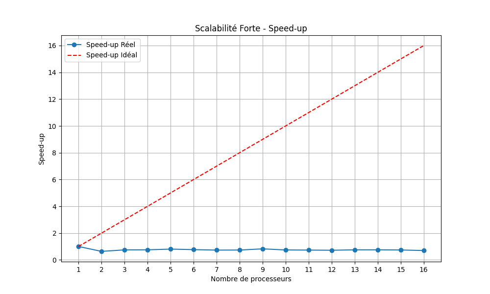
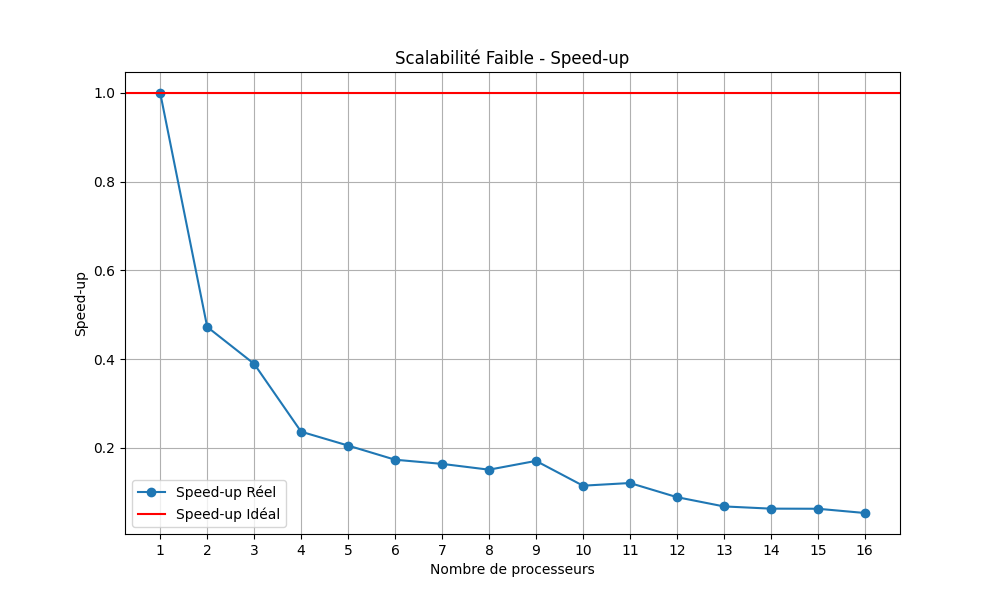
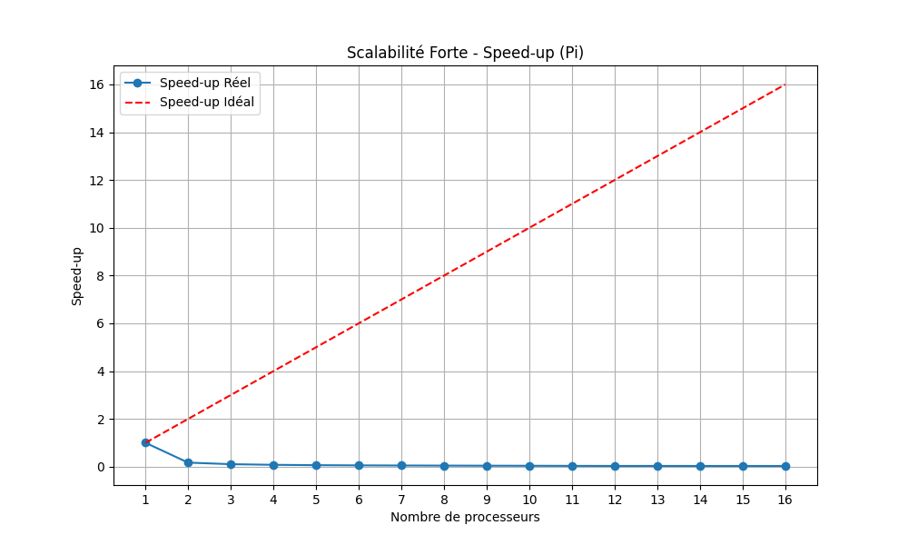
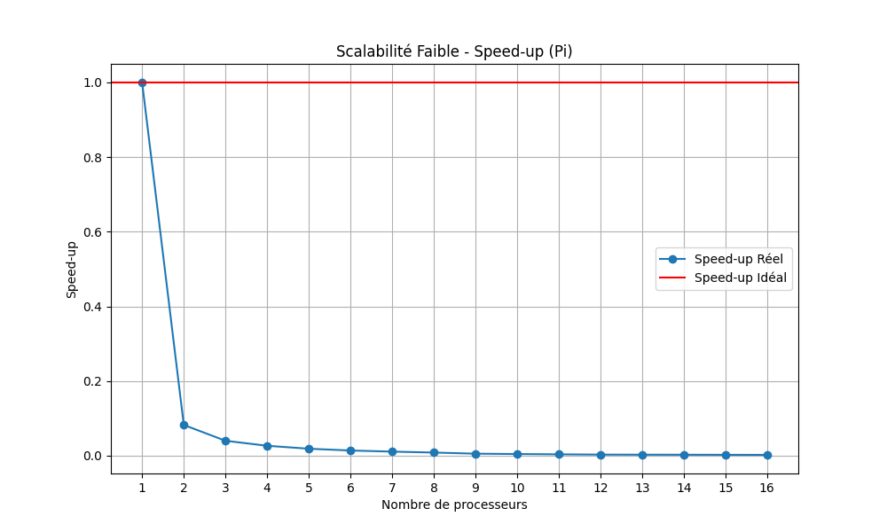

# 1. Méthode de Monte-Carlo

## **Introduction**

La méthode de **Monte-Carlo** est une technique probabiliste permettant d'approximer des valeurs numériques. Dans ce contexte, elle est utilisée pour estimer la valeur de **π (Pi)** à partir d'une simulation de tirages aléatoires. 

---

## **Principe**

### Aire d'un Quart de Disque

- Soit un quart de disque de rayon \( r = 1 \) :
  - L'aire du quart de disque est :  
    \[
    A_1 = \frac{\pi r^2}{4} = \frac{\pi}{4}
    \]

- Soit l'aire d'un carré de côté \( r = 1 \) :
  - L'aire du carré est :  
    \[
    A_2 = r^2 = 1
    \]

La probabilité qu’un point aléatoire \( X_p(x_p, y_p) \) tombe dans le quart de disque est donc :  
\[
P = \frac{A_1}{A_2} = \frac{\pi}{4}
\]

---

## **Algorithme de Base**

L'algorithme repose sur un grand nombre de tirages aléatoires (\( n_{tot} \)). On compte le nombre de points \( n_{cible} \) qui tombent à l'intérieur du quart de disque. Lorsque \( n_{tot} \) est grand, on peut approximer \( \pi \) par :

\[
\frac{n_{cible}}{n_{tot}} = \frac{\pi}{4} \implies \pi \approx 4 \times \frac{n_{cible}}{n_{tot}}
\]

**Pseudo-code :**

```plaintext
n_cible = 0
pour p = 0 à n_tot - 1 :
    x_p = rand()
    y_p = rand()
    si (x_p^2 + y_p^2 < 1) :
        n_cible++
π = 4 × (n_cible / n_tot)
```
## **Version Parallélisée**
```
n_cible = 0
n_tot[NBWORKER]
Nworker = NBWORKER
Ntotal

pour i = 0 à Nworker - 1 :
    n_tot[i] = Ntotal / Nworker

n_cible[i] = Worker_MC(i).start()

pour i = 0 à Nworker - 1 :
    n_cible += n_cible[i]

π = 4 × (n_cible / Ntotal)
```
---

## **Décomposition des Tâches**

L'algorithme parallèle peut être décomposé en plusieurs tâches distinctes :

1. **Tâche T0** : Tirer et compter les points
    - **T0p1** : Tirer les coordonnées \( X_p(x_p, y_p) \).
    - **T0p2** : Incrémenter le compteur `n_cible` si le point est dans le quart de disque.

2. **Tâche T1** : Calculer la valeur de \(\pi\) après l'exécution des tâches T0.

### **Dépendances entre les Tâches**

- **T1** dépend de **T0** pour obtenir le nombre total de points à l'intérieur du quart de disque.
- Les sous-tâches **T0p1** sont indépendantes entre elles : chaque thread peut générer ses points simultanément.
- Les sous-tâches **T0p2** sont également indépendantes entre elles.
- **T0p2** dépend de **T0p1** pour savoir si le point tiré doit être compté.

### **Identification d'une Ressource Critique**

Dans cette parallélisation, la variable `n_cible` est une ressource critique car plusieurs threads peuvent essayer de l'incrémenter en même temps.

**Section critique** :

```plaintext
n_cible++
```

# 2. Algorithme et parallélisation

## **Introduction**

La parallélisation permet d'accélérer l'exécution des algorithmes en répartissant le travail sur plusieurs unités de calcul. Deux approches classiques de parallélisation sont utilisées :

1. **Itération parallèle** : Les boucles sont exécutées en parallèle.
2. **Master/Worker** : Un maître distribue les tâches à des travailleurs et collecte les résultats.

---

## **a. Itération parallèle**

### **Principe**

L’itération parallèle consiste à répartir les différentes itérations d’une boucle sur plusieurs threads ou processus. Chaque itération est indépendante, ce qui permet une exécution simultanée sans conflits de données.

### **Exemple d'Itération Parallèle**

Voici un exemple en Java illustrant l’itération parallèle pour le calcul de \(\pi\) avec la méthode de Monte-Carlo :

```java
import java.util.concurrent.ExecutorService;
import java.util.concurrent.Executors;
import java.util.concurrent.atomic.AtomicInteger;

public class ParallelPi {
    public static void main(String[] args) {
        int nTotal = 16000000; // Nombre total d'itérations
        int nWorkers = 4;      // Nombre de threads
        AtomicInteger nCible = new AtomicInteger(0); // Compteur atomique pour éviter les conflits

        ExecutorService executor = Executors.newFixedThreadPool(nWorkers);

        for (int i = 0; i < nWorkers; i++) {
            executor.execute(() -> {
                int nLocal = nTotal / nWorkers;
                int localCible = 0;
                for (int j = 0; j < nLocal; j++) {
                    double x = Math.random();
                    double y = Math.random();
                    if (x * x + y * y < 1) {
                        localCible++;
                    }
                }
                nCible.addAndGet(localCible);
            });
        }

        executor.shutdown();
        while (!executor.isTerminated()) {
        }

        double pi = 4.0 * nCible.get() / nTotal;
        System.out.println("Estimation de Pi : " + pi);
    }
}
```
## **b. Approche Master/Worker**

### **Principe**

L'approche **Master/Worker** repose sur la délégation des tâches à plusieurs travailleurs (**Workers**) par un maître (**Master**). Le Master se charge de distribuer le travail, de collecter les résultats et de les agréger pour obtenir le résultat final.

---

### **Architecture Master/Worker**

- **Master** :
  - Initialise les connexions avec les Workers via des **sockets**.
  - Envoie le nombre de points à générer à chaque Worker.
  - Reçoit le nombre de points tombant dans le quart de disque de chaque Worker.
  - Calcule \(\pi\) à partir des résultats agrégés.

- **Workers** :
  - Écoute sur un port spécifique pour une connexion entrante.
  - Reçoit le nombre de points à tirer depuis le Master via un socket.
  - Effectue le calcul Monte-Carlo pour estimer \(\pi\).
  - Envoie le nombre de points tombant dans le quart de disque au Master via le socket.

---

### **Sockets : Explication**

Un **socket** est une interface logicielle permettant à deux applications de communiquer sur un réseau. Il existe deux types principaux de sockets :

1. **Socket côté serveur (Worker)** :
   - Crée un socket d'écoute sur un port spécifique.
   - Attend les connexions entrantes du Master.
   - Accepte la connexion et échange des données avec le Master.

2. **Socket côté client (Master)** :
   - Se connecte au socket du Worker sur le port spécifié.
   - Envoie des données au Worker.
   - Reçoit les résultats du Worker.

Les sockets utilisent le modèle **TCP/IP** pour garantir une communication fiable.

---

### **Code Java : MasterSocket**

Le code du **Master** utilise des sockets pour se connecter aux Workers, envoyer des données et recevoir les résultats.

#### **Fonctionnement du Master**

1. **Initialisation des paramètres** :
   - Nombre total de tirages (`totalCount`).
   - Nombre de Workers (`numWorkers`).

2. **Connexion aux Workers** :
   - Le Master se connecte aux Workers sur des ports spécifiés.

3. **Envoi des données** :
   - Le Master envoie le nombre de points à tirer à chaque Worker via le socket.

4. **Réception des résultats** :
   - Le Master reçoit le nombre de points tombant dans le quart de disque de chaque Worker.

5. **Calcul de \(\pi\)** :
   - \(\pi\) est calculé à partir des résultats agrégés.

#### **Extrait de Code : MasterSocket.java**

```java
// Initialisation des paramètres
int totalCount = 16000000;
int numWorkers = 4;
String message_to_send = String.valueOf(totalCount);

// Connexion aux Workers
Socket[] sockets = new Socket[numWorkers];
PrintWriter[] writer = new PrintWriter[numWorkers];
BufferedReader[] reader = new BufferedReader[numWorkers];
int[] tab_port = {25545, 25546, 25547, 25548};

for (int i = 0; i < numWorkers; i++) {
    sockets[i] = new Socket("localhost", tab_port[i]);
    writer[i] = new PrintWriter(sockets[i].getOutputStream(), true);
    reader[i] = new BufferedReader(new InputStreamReader(sockets[i].getInputStream()));
}

// Envoi des données aux Workers
for (int i = 0; i < numWorkers; i++) {
    writer[i].println(message_to_send);
}

// Réception des résultats des Workers
int total = 0;
for (int i = 0; i < numWorkers; i++) {
    total += Integer.parseInt(reader[i].readLine());
}

// Calcul de Pi
double pi = 4.0 * total / (totalCount * numWorkers);
System.out.println("Estimation de Pi : " + pi);
```
# 3. Analyse des Performances

## **Introduction**

L’analyse des performances vise à évaluer le comportement et l’efficacité d’un programme parallélisé. Elle permet de comprendre comment le programme utilise les ressources disponibles (processeurs, mémoire) et d’identifier les limites de la parallélisation. Pour **Assignment102**, l’analyse des performances se concentre sur deux types de scalabilité :

1. **Scalabilité Forte** :  
   Le temps d’exécution est mesuré pour une charge de travail fixe en augmentant le nombre de processeurs.

2. **Scalabilité Faible** :  
   Le temps d’exécution est mesuré lorsque la charge de travail augmente proportionnellement au nombre de processeurs.

Ces analyses sont essentielles pour déterminer si le programme tire pleinement parti du parallélisme.

---

## **a. Analyse de Code : Assignment102**

### **Description du Programme**

**Assignment102** implémente la méthode de **Monte-Carlo** pour le calcul de \(\pi\) en utilisant une approche parallélisée basée sur des **threads** Java. Le programme mesure les performances pour deux types de scalabilité : forte et faible, et enregistre les résultats dans des fichiers CSV pour analyse.

### **Structure du Code**

Le programme est structuré autour de trois composants principaux :

1. **Classe `PiMonteCarlo`** :  
   - Effectue le calcul de \(\pi\) en utilisant la méthode de Monte-Carlo avec un pool de threads.
   - Utilise un compteur atomique pour éviter les conflits d'accès en parallèle.

2. **Fonction `performMultipleTests`** :  
   - Exécute le calcul plusieurs fois pour chaque configuration afin d’obtenir une moyenne fiable du temps d’exécution.

3. **Fonction `main`** :  
   - Organise les tests de scalabilité forte et faible.
   - Sauvegarde les résultats dans des fichiers CSV.

---

### **Classe `PiMonteCarlo`**

Cette classe est responsable du calcul de \(\pi\) en utilisant la méthode de Monte-Carlo parallélisée.

**Code :**

```java
class PiMonteCarlo {
    AtomicInteger nAtomSuccess;
    int nThrows;

    class MonteCarlo implements Runnable {
        @Override
        public void run() {
            double x = Math.random();
            double y = Math.random();
            if (x * x + y * y <= 1)
                nAtomSuccess.incrementAndGet();
        }
    }

    public double getPi(int nProcessors) {
        ExecutorService executor = Executors.newFixedThreadPool(nProcessors);
        for (int i = 1; i <= nThrows; i++) {
            Runnable worker = new MonteCarlo();
            executor.execute(worker);
        }
        executor.shutdown();
        while (!executor.isTerminated()) {}
        return 4.0 * nAtomSuccess.get() / nThrows;
    }
}
```

## **b. Analyse de Code : Pi.java**

### **Introduction**

Le programme **Pi.java** utilise la méthode de Monte-Carlo pour estimer la valeur de \(\pi\). Il est structuré pour permettre une parallélisation du calcul, en utilisant plusieurs threads pour effectuer des tirages aléatoires simultanément. L’objectif de ce programme est de mesurer les performances du calcul parallélisé et de les comparer à l’exécution séquentielle.

---

### **Structure du Code**

Le programme est structuré en deux classes principales :

1. **Classe `Master`** :  
   - Coordonne le travail des threads.
   - Lance les tâches et agrège les résultats.

2. **Classe `Worker`** :  
   - Effectue les tirages aléatoires pour le calcul de \(\pi\).
   - Retourne le nombre de points tombant dans le quart de disque.

---

### **Classe `Master`**

La classe `Master` crée et lance les threads pour effectuer le calcul en parallèle.

**Code :**

```java
class Master {
    public void doRun(int totalCount, int numWorkers) throws InterruptedException, ExecutionException {
        List<Callable<Long>> tasks = new ArrayList<>();
        for (int i = 0; i < numWorkers; ++i) {
            tasks.add(new Worker(totalCount / numWorkers));
        }

        ExecutorService exec = Executors.newFixedThreadPool(numWorkers);
        exec.invokeAll(tasks);
        exec.shutdown();
    }
}
```
# 4. Qualité et Test de Performance

## **Introduction**

L’évaluation de la qualité d’un programme parallélisé repose sur des mesures de performance, telles que le **temps d’exécution**, le **speed-up**, et la **scalabilité**. Ces mesures permettent de vérifier si le programme fonctionne correctement et de s'assurer qu'il tire pleinement parti des ressources disponibles.

Les tests de performance sont essentiels pour :

1. Identifier les goulots d’étranglement.
2. Évaluer l’efficacité du parallélisme.
3. Comparer les performances entre différentes approches (par exemple, **Assignment102** et **Pi.java**).

---

## **a. Évaluation et Test de Performance**

### **Objectifs des Tests**

Les tests de performance visent à :

1. **Mesurer le temps d’exécution** en fonction du nombre de processeurs.
2. **Évaluer le speed-up** pour les scalabilités forte et faible.
3. **Comparer les résultats** obtenus avec des théories idéales (speed-up linéaire).
4. **Identifier les limites** de l’implémentation parallélisée.

---

### **Résultats des Tests**

Les tests ont été réalisés avec les programmes **Assignment102** et **Pi.java**. Les mesures obtenues ont été enregistrées dans des fichiers CSV et représentées graphiquement. Voici une analyse des résultats obtenus.

---

#### **Scalabilité Forte**

La scalabilité forte mesure l’évolution du temps d’exécution pour une charge de travail fixe en augmentant le nombre de processeurs.

**Graphe : Scalabilité Forte - Speed-Up (Assignment102)**



**Analyse :**

- Le **speed-up réel** augmente avec le nombre de processeurs, mais il s’écarte progressivement du **speed-up idéal**.
- Cela indique que le programme bénéficie du parallélisme jusqu’à un certain nombre de processeurs, après quoi des phénomènes de **synchronisation** et de **surcharge** limitent les gains de performance.

---

#### **Scalabilité Faible**

La scalabilité faible mesure l’évolution du temps d’exécution lorsque la charge de travail augmente proportionnellement au nombre de processeurs.

**Graphe : Scalabilité Faible - Speed-Up (Assignment102)**



**Analyse :**

- Le **speed-up réel** reste relativement constant lorsque la charge de travail augmente proportionnellement au nombre de processeurs.
- Toutefois, des écarts par rapport au **speed-up idéal** peuvent apparaître en raison des **communications inter-threads** et des **variations de charge**.

---

#### **Scalabilité Forte pour Pi.java**

**Graphe : Scalabilité Forte - Speed-Up (Pi.java)**



**Analyse :**

- Le programme **Pi.java** montre une amélioration du speed-up avec l'augmentation du nombre de processeurs.
- Cependant, le **speed-up réel** est limité par des facteurs tels que :
  - La **synchronisation** des threads.
  - La **surcharge liée à la création des threads**.

---

#### **Scalabilité Faible pour Pi.java**

**Graphe : Scalabilité Faible - Speed-Up (Pi.java)**



**Analyse :**

- La courbe de speed-up pour la scalabilité faible indique une **dégradation progressive des performances** lorsque le nombre de processeurs augmente.
- Cette dégradation peut être attribuée à :
  - La **latence de communication**.
  - Le **déséquilibre de charge** entre les threads.
  - Les **limites matérielles** du système.

---

## **Conclusion des Tests**

1. **Assignment102** :  
   - Le programme fonctionne bien lorsque le nombre de processeurs augmente.
   - On observe une diminution du temps d’exécution, mais les performances ne sont pas toujours parfaites.
   - À partir d’un certain nombre de processeurs, le programme a du mal à aller plus vite à cause des limites liées à la gestion des threads.

2. **Pi.java** :  
   - Le programme bénéficie du parallélisme et le temps d’exécution diminue avec plus de processeurs.
   - Toutefois, le gain de performance devient moins important à mesure que le nombre de processeurs augmente.
   - Cela peut être dû au temps nécessaire pour gérer plusieurs threads en même temps.

3. **Résumé Général** :  
   - Les deux programmes montrent que le parallélisme permet d’accélérer les calculs.
   - Cependant, ajouter trop de processeurs ne donne pas toujours de meilleurs résultats.
   - Les tests montrent qu’il y a une limite à l’efficacité du parallélisme, probablement due aux échanges entre threads et au matériel utilisé.

## **b. Qualité de Développement**

La norme **ISO/IEC 25010** propose des critères pour évaluer la qualité des logiciels. Ces critères permettent d’analyser différents aspects du programme. Voici comment les programmes **Assignment102** et **Pi.java** répondent à ces critères en se basant sur les analyses de performance précédentes.

### **1. Performance et Efficacité**

- **Scalabilité Forte** et **Scalabilité Faible** :  
  Les tests ont montré que les deux programmes utilisent efficacement le parallélisme pour réduire le temps d’exécution. Cependant, les gains de performance diminuent à mesure que le nombre de processeurs augmente.
  
  Cela correspond au critère **"Performance Efficiency"** de la norme **ISO/IEC 25010**, qui inclut :
  - **Time Behavior** : Temps d’exécution en fonction des ressources utilisées.
  - **Resource Utilization** : Utilisation des processeurs de manière équilibrée.

### **2. Fiabilité**

- Les programmes offrent une fiabilité acceptable dans le calcul de \(\pi\) grâce à des répétitions de tests (moyenne sur 10 exécutions). Cela garantit des résultats cohérents malgré des variations possibles dues au système.

  Cela correspond au critère **"Reliability"**, notamment :
  - **Maturity** : Capacité à produire des résultats stables.
  - **Fault Tolerance** : Résistance aux petites variations de charge.

### **3. Maintenabilité**

- Les programmes sont bien structurés avec une séparation claire des tâches (`Master`, `Worker` et `PiMonteCarlo`). Cette organisation facilite la compréhension et la modification du code.

  Cela répond au critère **"Maintainability"** :
  - **Modularity** : Code divisé en composants indépendants.
  - **Analyzability** : Facilité à analyser et comprendre le code.

### **4. Utilisabilité**

- L’utilisation de fichiers **CSV** pour enregistrer les résultats permet une analyse simple des performances avec des graphiques. Cela facilite l’évaluation et l’interprétation des résultats.

  Ce point correspond au critère **"Usability"** :
  - **Operability** : Facilité d'utilisation des programmes pour effectuer des tests et analyser les résultats.

---

### **Conclusion**

Les programmes **Assignment102** et **Pi.java** respectent plusieurs critères de la norme **ISO/IEC 25010** en matière de performance, fiabilité, maintenabilité et utilisabilité. Les tests de performance montrent que les programmes sont efficaces et produisent des résultats fiables, tout en étant structurés de manière à faciliter leur maintenance et leur utilisation.


# 5. Mise en Œuvre en Mémoire Distribuée

## **Introduction**

La mise en œuvre en mémoire distribuée permet d'exécuter des programmes sur plusieurs machines connectées en réseau. Chaque machine dispose de sa propre mémoire, et les échanges de données se font via des protocoles de communication comme **TCP/IP**. Cette approche permet d'augmenter les ressources disponibles et d'améliorer les performances pour des calculs intensifs.

Dans cette section, nous allons nous concentrer sur l’utilisation des **Java Sockets** pour établir une communication entre différentes machines.

---

## **a. Java Socket**

### **Principe des Sockets**

Les **sockets** sont des points de communication permettant à des processus situés sur des machines différentes de s'échanger des données via un réseau. Ils sont basés sur le modèle **client-serveur** :

1. **Socket Serveur** :  
   - Écoute sur un port spécifique en attente de connexions.
   - Accepte les connexions des clients et échange des données avec eux.

2. **Socket Client** :  
   - Se connecte à une socket serveur via une adresse IP et un port.
   - Envoie des requêtes et reçoit des réponses du serveur.

---

### **Mise en Œuvre avec Master/Worker**

Dans le contexte des programmes **Master/Worker**, le **Master** joue le rôle du **client**, et les **Workers** jouent le rôle des **serveurs**. Le Master distribue des tâches aux Workers via des sockets, et les Workers renvoient les résultats après avoir effectué le calcul.

---

### **Exemple de Code en Java**

#### **MasterSocket.java**

Le **Master** se connecte aux Workers, envoie le nombre de points à tirer et reçoit les résultats.

```java
import java.io.*;
import java.net.*;
import java.util.Scanner;

public class MasterSocket {
    public static void main(String[] args) throws IOException {
        int totalCount = 16000000;
        int numWorkers = 4;
        int[] ports = {25545, 25546, 25547, 25548};

        Socket[] sockets = new Socket[numWorkers];
        PrintWriter[] writers = new PrintWriter[numWorkers];
        BufferedReader[] readers = new BufferedReader[numWorkers];

        // Connexion aux Workers
        for (int i = 0; i < numWorkers; i++) {
            sockets[i] = new Socket("localhost", ports[i]);
            writers[i] = new PrintWriter(sockets[i].getOutputStream(), true);
            readers[i] = new BufferedReader(new InputStreamReader(sockets[i].getInputStream()));
        }

        // Envoi du nombre de points à chaque Worker
        for (int i = 0; i < numWorkers; i++) {
            writers[i].println(totalCount / numWorkers);
        }

        // Réception des résultats des Workers
        int totalHits = 0;
        for (int i = 0; i < numWorkers; i++) {
            totalHits += Integer.parseInt(readers[i].readLine());
        }

        // Calcul de Pi
        double pi = 4.0 * totalHits / totalCount;
        System.out.println("Estimation de Pi : " + pi);

        // Fermeture des connexions
        for (int i = 0; i < numWorkers; i++) {
            sockets[i].close();
        }
    }
}
```

## **b. Master/Worker**

### **Introduction**

Le modèle **Master/Worker** est une approche de parallélisation permettant de distribuer des tâches sur plusieurs entités de calcul appelées **Workers**. Le **Master** coordonne l'ensemble du processus en divisant le travail et en rassemblant les résultats fournis par les Workers.

Cette approche est particulièrement adaptée pour les applications nécessitant de nombreux calculs indépendants. Elle permet d'exploiter efficacement les ressources disponibles sur plusieurs machines connectées via un réseau.

---

### **Fonctionnement**

1. **Master** :  
   - Divise le travail en plusieurs sous-tâches.  
   - Envoie chaque sous-tâche à un Worker via une connexion réseau (par exemple, une socket).  
   - Rassemble les résultats envoyés par les Workers.  
   - Calcule le résultat final après avoir reçu tous les résultats.

2. **Workers** :  
   - Reçoivent des sous-tâches du Master.  
   - Effectuent les calculs demandés.  
   - Renvoient les résultats au Master.


---

### **Exemple d’Utilisation en Java**

Le modèle **Master/Worker** peut être implémenté en Java en utilisant des **sockets** pour permettre la communication entre le Master et les Workers.

#### **Code du Master**

Le **Master** distribue le nombre de tirages aléatoires à chaque Worker et reçoit les résultats.

```java
import java.io.*;
import java.net.*;

public class MasterSocket {
    public static void main(String[] args) throws IOException {
        int totalCount = 16000000;
        int numWorkers = 4;
        int[] ports = {25545, 25546, 25547, 25548};

        Socket[] sockets = new Socket[numWorkers];
        PrintWriter[] writers = new PrintWriter[numWorkers];
        BufferedReader[] readers = new BufferedReader[numWorkers];

        // Connexion aux Workers
        for (int i = 0; i < numWorkers; i++) {
            sockets[i] = new Socket("localhost", ports[i]);
            writers[i] = new PrintWriter(sockets[i].getOutputStream(), true);
            readers[i] = new BufferedReader(new InputStreamReader(sockets[i].getInputStream()));
        }

        // Envoi du nombre de tirages à chaque Worker
        for (int i = 0; i < numWorkers; i++) {
            writers[i].println(totalCount / numWorkers);
        }

        // Réception des résultats des Workers
        int totalHits = 0;
        for (int i = 0; i < numWorkers; i++) {
            totalHits += Integer.parseInt(readers[i].readLine());
        }

        // Calcul de Pi
        double pi = 4.0 * totalHits / totalCount;
        System.out.println("Estimation de Pi : " + pi);

        // Fermeture des connexions
        for (int i = 0; i < numWorkers; i++) {
            sockets[i].close();
        }
    }
}
```

# 6. Performance Master/Worker Distribué

## **Introduction**

L’évaluation des performances du modèle **Master/Worker distribué** permet de comprendre comment le système se comporte lorsque le calcul est réparti sur plusieurs machines en réseau. Grâce à cette approche, les tâches peuvent être exécutées en parallèle sur plusieurs processeurs situés sur différentes machines, optimisant ainsi le temps d’exécution des calculs intensifs.

---

## **Analyse des Performances**

### **Scalabilité Forte**

La **scalabilité forte** mesure l’évolution du temps d’exécution lorsque le nombre de processeurs augmente, tandis que la charge de travail totale reste fixe.

#### **Graphique : Scalabilité Forte - MonteCarlo Distribué**


**Analyse :**

- Le **speed-up réel** augmente avec le nombre de processeurs, mais il reste légèrement inférieur au **speed-up idéal**.
- La courbe montre une amélioration notable des performances avec l’ajout de processeurs, bien que l’efficacité diminue légèrement à cause de la surcharge de communication entre le **Master** et les **Workers**.

---

### **Scalabilité Faible**

La **scalabilité faible** mesure l’évolution du temps d’exécution lorsque la charge de travail augmente proportionnellement au nombre de processeurs.

#### **Graphique : Scalabilité Faible - MonteCarlo Distribué**


**Analyse :**

- Le **speed-up réel** reste relativement constant avec l’augmentation du nombre de processeurs.
- Toutefois, de petites variations apparaissent, probablement dues à la **latence réseau** et à la **répartition inégale de la charge**.
- L’efficacité globale du système reste élevée, ce qui montre que le modèle Master/Worker distribué fonctionne correctement pour des charges de travail croissantes.

---

## **Conclusion**

- La mise en œuvre du modèle **Master/Worker distribué** permet d’améliorer les performances des calculs parallélisés.
- La **scalabilité forte** montre que le speed-up augmente avec le nombre de processeurs, bien que des limites apparaissent en raison des communications réseau.
- La **scalabilité faible** prouve que le système peut gérer efficacement des charges de travail croissantes tout en maintenant un bon niveau de performance.
- Le modèle Master/Worker distribué est donc une solution adaptée pour les calculs intensifs nécessitant une parallélisation sur plusieurs machines.


Ce compte-rendu a été rédigé avec l'aide de l'intelligence artificielle ChatGPT-4o dans le but de reformuler et de corriger les fautes d'orthographe.
